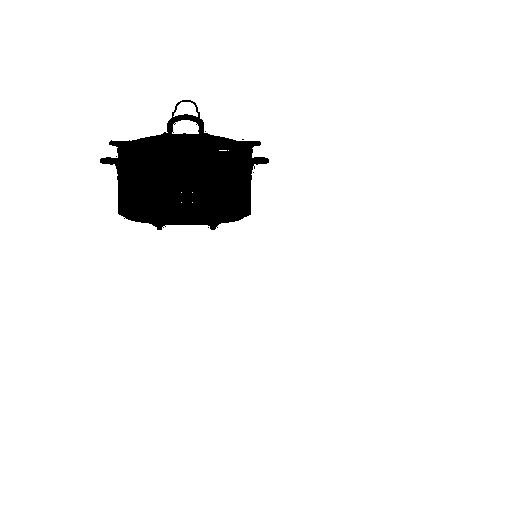

# Product Video Generation

## Problem Statement

Given an image of a produc and textual description of the background, generate an image of the exact product with the described background. Next generate multiple such images to create a video of the product in this background.

## Approach and Methodology

TL;DR - Used stable diffusion model to inpaint the background with the product fixed.

### Image Generation

Steps:
1. Resize the image and expand the white background to get space for creating the text-conditioned background.
2. Next step was to apply image segmentation to take out the product image from the white background. This will provide us with masked image with product and background separated. We have used simle rule based method to perform this task as the background was consistently white. We could also use other sophisticated techniques to get more accurate segmentation.
3. The mask and the original image was then passed through to the ```runwayml/stable-diffusion-inpainting``` mode. The Stable-Diffusion-Inpainting model was initialized with the weights of the Stable-Diffusion-v-1-2. First 595k steps regular training, then 440k steps of inpainting training at resolution 512x512 on “laion-aesthetics v2 5+” and 10% dropping of the text-conditioning to improve classifier-free classifier-free guidance sampling. 

To make sure the image of the product is exactly the same after generating the backgroud, we use the previous mask to replace the product in the output of the diffusion model with the actual image.

For this step we also experimented with ```stabilityai/stable-diffusion-2-inpainting``` and the default ```runwayml/stable-diffusion-v1-5```. We noticed for inpainting of the background ```runwayml/stable-diffusion-inpainting``` outperforms the other models and hence we have chosen it to be default model.

### Video Generation

Steps:
1. We use the above generated image as the first frame of the video.
2. We have implemented only a translatory motion of the object. 
3. The main method consists of rolling the image in x and y direction by some pixels and create a mask for the new pixels that came into due to rolling the image. Then with this mask and same prompt as earlier we generate a new image using the ```stabilityai/stable-diffusion-2-inpainting```. During the experimentation phase, we observed this model worked better than ```runwayml/stable-diffusion-inpainting``` consistent frame generation. 

The ```shift_image``` function takes and np.array of the PIL image and rolls the image by specified number od pixels and returns the shifted image. We use this function for the image and mask generation as well. The shifted image, shifted mask and text prompt is givent o the LDM to generate new image.

We have introduced an entity ```shifts``` which can be used to control the motion of the product/image. In the current implementation this is a hardcoded list which make the product move along the line y=2x for the first 20 frames and then along y=x/2 for the next 20 frames. We can make this create this array ```shifts``` in such a way that we can have the product move on any path. 

We apply the same steps N times to generate N sequential frames. 

Similar to image generation, to reduce the propagation of decoding-encoding error due to latent representation conversion of the whole image we used only the newly generated part and kept rest of the image same as the previous image.

4. To save the video, we use ```imageio``` library with the list of frames and desired fps.


## Results 

### Resized and Mask Generation

<br />

<br />

### Successful Image Generation with Runway Inpainting Model

<br />

<br />

### Failed Image Generation with StabilityAI Inpainting Model
Object and surrounding not matching. The utensil is floating mid air.

<br />

<br />

### Successful Video Generation with Stability Inpainting Model


### Failed Video Generation when not retaining previous images
This led to error being accumulated over multiple generations leading to deep dream-esque output.


